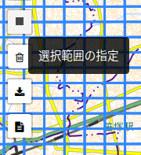
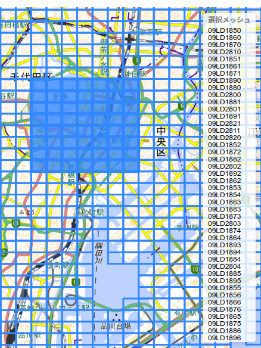
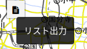

# Tokyo 3D visualization inf Foxglove

1. Download urllist

* Go to this [link](https://www.geospatial.jp/ckan/dataset/tokyopc-23ku-2024/resource/7807d6d1-29f3-4b36-b0c8-f7aa0ea2cff3?inner_span=True).

* Use the square selection 

    

* Select the parts to download

    

* Download `urllist.txt` file

    

* Copy the file `urllist.txt` downloaded to the root folder of this repo. It should look like this:

    * `tokyo3d`
        
        * `schemas`
        * `scripts`
        * `README.md`
        * **`urllist.txt`**

2. Execute script

* `python3 las_to_pc.py` with the following arguments

    * download: [True,False]. Download new set of zip files (`urllist.txt` required)
    * mcap_filename: Final output file.
    * max_points: Number of points in the last output.

3. View in Foxglove

* Load the layout [Tokyo3D.json](schemas/Tokyo3D.json).
* Open the generated mcap file.

*Note: the pointcloud is not centered in position (0,0), but rather around position (-6000,-37000)*
